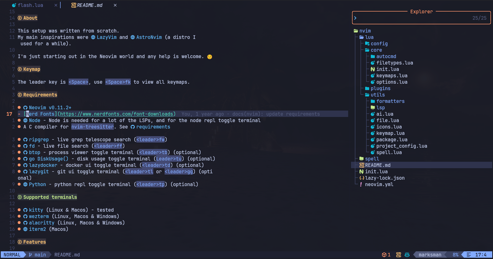

# Neovim

<!--toc:start-->
- [Neovim](#neovim)
  - [About](#about)
  - [Requirements](#requirements)
  - [Features](#features)
    - [Auto completation with AI](#auto-completation-with-ai)
    - [Wakatime](#wakatime)
    - [Background Transparence](#background-transparence)
  - [Installing](#installing)
  - [Mappings](#mappings)
  - [Preview](#preview)
<!--toc:end-->

## About

This NeoVim config is based on the [AstroNvim](https://github.com/AstroNvim/AstroNvim) config.  

> [!NOTE]  
> The configuration was built based on the template suggested by [AstroNvim](https://github.com/AstroNvim/template).

## Requirements

It's the same requirements as [AstroNvim](https://docs.astronvim.com/#-requirements).

- [lazydocker](https://github.com/jesseduffield/lazydocker) docker ui toggle
  terminal (`leader + td`) (optional)

## Features

### Auto completation with AI

This config uses Codeium to autocomplete your code. You will need a Codeium
account and api key to do this.

For more information about that see the
[Exafunction/codeium.vim](https://github.com/Exafunction/codeium.vim) plugin documentation.

To disable the feature comment out or remove this line in the
`plugins/community.lua` file:

```lua
-- Comment out our remove this line
-- { import = "astrocommunity.completion.codeium-vim" },
```

### Wakatime

To use Wakatime needs to define Wakatime
[API key](https://wakatime.com/settings#apikey)
and to be installed [wakatime-cli](https://github.com/wakatime/wakatime-cli).
More information on [wakatime/vim-wakatime](https://github.com/wakatime/vim-wakatime).

To disable the feature comment out or remove this line in the
`plugins/community.lua` file:

```lua
-- Comment out our remove this line
-- { import = "astrocommunity.media.vim-wakatime" },
```
### Background Transparence

This config uses [transparent.nvim](https://github.com/xiyaowong/transparent.nvim) to make the background transparent.

> [!TIP]  
> You can use `:TransparentToggle` to toggle the background transparency.

## Installing

Make a backup of your current nvim folder

```bash
mv ~/.config/nvim ~/.config/nvim.bak
```

Clean neovim folders

```bash
mv ~/.local/share/nvim ~/.local/share/nvim.bak
mv ~/.local/state/nvim ~/.local/state/nvim.bak
mv ~/.cache/nvim ~/.cache/nvim.bak
```

Clone my config into `~/.config/nvim`

```bash
git clone --depth 1 https://github.com/gabrielscaranello/dotfiles.new /tmp/dotfiles
```

Copy the cloned config to `~/.config/nvim`

```bash
cp -r /tmp/dotfiles/config/nvim ~/.config
```

Start Neovim

```bash
nvim
```

## Mappings

This configuration has all AstroNvim mappings, you can check them out [here](https://astronvim.com/Basic%20Usage/mappings).

| Action                           | Mappings         |
| -------------------------------- | ---------------- |
| Save file                        | `Ctrl + s`       |
| LSP Restart (if LSP is attached) | `Leader + lk`    |
| No Highlight                     | `Leader + space` |
| ToggleTerm lazydocker            | `Leader + td`    |
| ToggleTerm lazygit               | `Leader + gg`    |
| Open Diffview                    | `Leader + gD`    |
| Close Diffview                   | `Leader + gx`    |
| Next buffer                      | `Shift + l`      |
| Previous buffer                  | `Shift + h`      |
| Call : command                   | `;`              |

## Preview



> Using [kitty terminal](https://sw.kovidgoyal.net/kitty/) and [JetBrains Mono NF](https://github.com/ryanoasis/nerd-fonts/tree/master/patched-fonts/JetBrainsMono/Ligatures).

